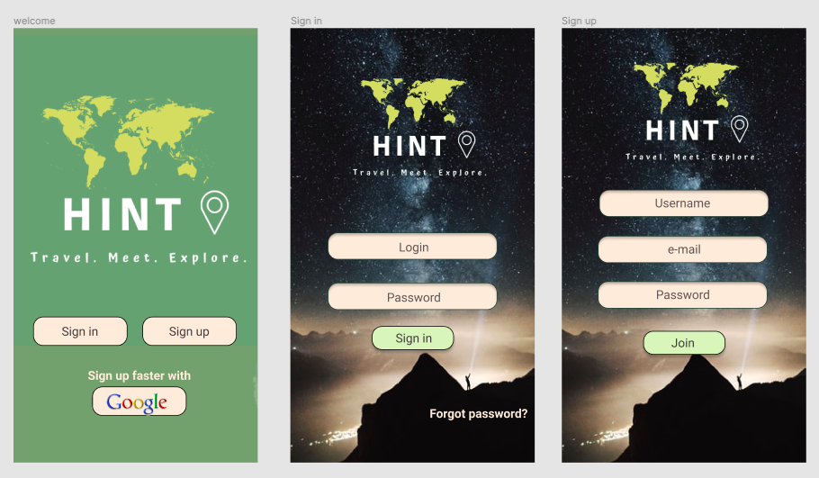
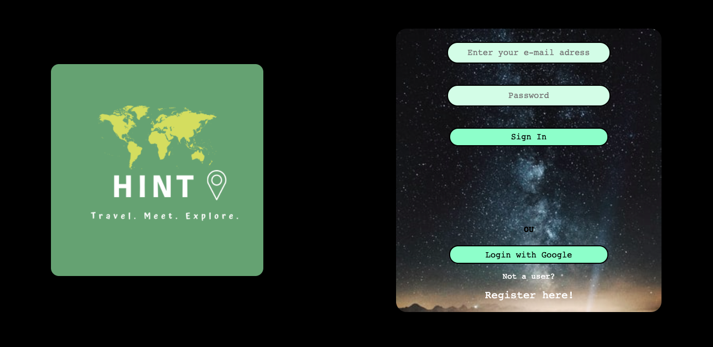
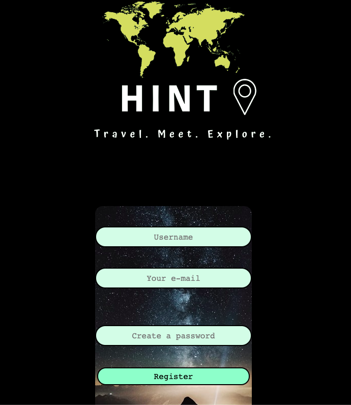
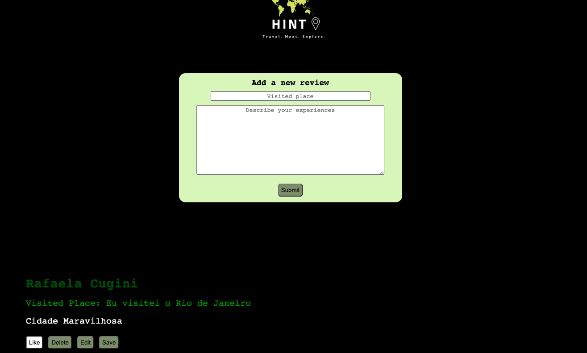

# HINT

### Uma rede social para viajantes

- [1. Resumo do projeto](#1-resumo-do-projeto)
- [2. Pesquisa](#2-pesquisa)
- [3. Histórias de usuário](#3-histórias-de-usuário)

---
<h1>
  
</h1>

## 1. Resumo do projeto

Nosso projeto se chama HINT (uma Rede Social) para viajantes e/ou pessoas que gostariam de viajar.
No HINT você pode dar dicas de lugares que você já viajou, sozinho, com o parceiro(a) e/ou visualizar dicas de pessoas que já viajaram para algum lugar que você deseja ir.

## 2. Pesquisa

Fizemos uma breve pesquisa de usuário:

<h1>
  
</h1>

### Protótipo de alta fidelidade

<h1>
  
</h1>

---

## 3. Histórias de usuário

- Tela Inicial:
  - Quando o usuário acessar a página HINT, encontrará a página de login;
  - Caso o usuário queira entrar pela conta do Google, basta clicar no botão _Login with Google_ e será direcionado ao Feed;

  <h1>
  
  </h1>

- Tela Register
  - Se o usuário preferir poderá fazer o cadastro por e-mail e senha clicando no campo _Register Here!_;
  - Na página de cadastro o usuário colocará _Nome de Usuário_ , _E-mail_ e _Senha_ e terá que retornar a página inicial, colocar os dados cadastrados e então será direcionado ao Feed;

  <h1>
  
  </h1>

- Feed
  - No Feed o usuário encontrará o campo para colocar o nome do Lugar/Cidade/País que viajou e/ou gostaria de viajar; em seguida colocará a mensagem e clicará no botão _Submit_ para enviar;
  - Em seguida a mensagem aparecerá no Feed e o usuário poderá _Curtir_ , _Deletar_ , _Editar_ e _Salvar_ o comentário que o mesmo fez.

  <h1>
  
</h1>

Colaboração:

[Mariana Rocha](https://github.com/marirr86) e
[Rafaela Cugini](https://github.com/RafaelaCugini)